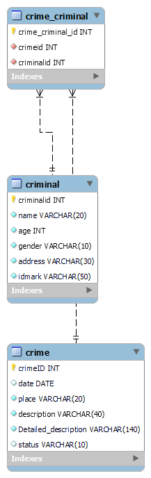

# Crime Information Management System

The main aim of this system is to maintain and manage the detail information of the crime happened in  an  area under a particular police station. This software will be used by the police officials in the Police station. 

## Features

- Adding a Crime Record.
- Adding a Criminal Record 
- Search Crimes by Query
- Search Criminals by Query
- Update Crime Status
- Get Crimes Comitted by a Criminal
- Get Criminals associated with Crime
- Number of Crimes Recorded in current month

## Tech Stack

- Java
- JDBC
- MySQL
- GitHub

## Table Scema

